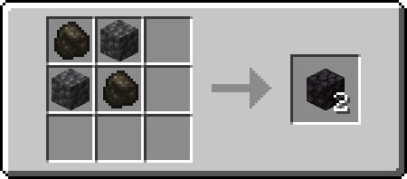
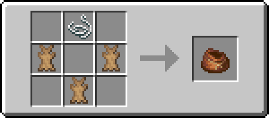
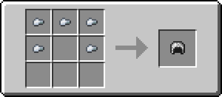
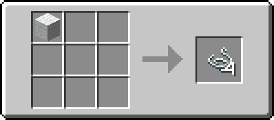
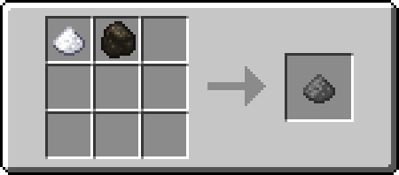
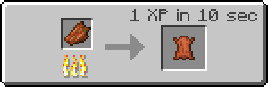

# Mods for mc.azaleaplays.com

The server uses the [Fabric Mod Loader](https://fabricmc.net/use/)

Start: 

## Table of contents

* [Server Side Mods](#server-side-mods)
* [Datapacks](#datapacks)
* [Suggested Client Side Mods](#suggested-client-side-mods)
* [Shader Mods](#shader-mods)
* [Custom Recipes](#custom-recipes)

## Server Side Mods

### [Invisible Frames](https://www.curseforge.com/minecraft/mc-mods/invisible-frames)

* Shift and punch to toggle frame visibility

### [FallingTree](https://www.curseforge.com/minecraft/mc-mods/falling-tree)

* When you chop a log with an axe, it will replace it with a block from the top of the tree
* Hold shift while chopping to disable the breaking mode

### [Connected Doors](https://www.curseforge.com/minecraft/mc-mods/connected-doors)

* Double doors open and close together by right clicking and redstone
* Client Side optional

### [Simple Voice Chat](https://www.curseforge.com/minecraft/mc-mods/simple-voice-chat)

* Allows proximity voice chat
* Client side required (server can be joined without this mod though)

## Datapacks

### [William Wythers Overhaul Overworld](https://www.planetminecraft.com/data-pack/william-wythers-overhauled-overworld/)

* Alternative terrain generation
* Addons
  * [Phantasmal Forest](https://www.planetminecraft.com/data-pack/phantasmal-forest-add-on-for-william-wythers-overhauled-overworld-1-16-5/)
  * [Caves and Cliffs](https://www.planetminecraft.com/data-pack/william-wythers-caves-and-cliffs-add-on-for-overhauled-overworld-1-17/)
  * [More Structures](https://www.planetminecraft.com/data-pack/more-structures-add-on-for-william-wythers-overhauled-overworld-1-16-4/)

### [BlazeandCave's Advancements Pack](https://www.curseforge.com/minecraft/customization/blazeandcaves-advancements-pack)

* Lots and lots of advancements
* Rewards are disabled

### [Vanilla Tweaks](https://vanillatweaks.net/picker/datapacks/)

* Armor Statues - Can make Armor Statues change potition and hold items - [video](https://www.youtube.com/watch?v=nV9-_RacnoI)
* Armored Elytra - Combine elytras and chestplates - [video](https://www.youtube.com/watch?v=UCUivDpVDhE)
* Unlock All Recipes
* Custom Nether Portals - Nether portals can have different shapes now - [video](https://www.youtube.com/watch?v=WfqUtUhI7qM)
* Player Head Drops - [video](https://www.youtube.com/watch?v=Usb1mEIK_wQ)
* Double Shulker Shells - Killing a shulker will give 2 shells - [video](https://www.youtube.com/watch?v=lfcwKXhjC9Y&t=319s)
* More Mob Heads - Killing mobs sometimes gives heads - [video](https://www.youtube.com/watch?v=lfcwKXhjC9Y&t=487s)
* Silence Mobs - Make mobs silent with a nametag - [video](https://www.youtube.com/watch?v=lfcwKXhjC9Y&t=487s)
* Wandering Trages - Trade with wandering trader to get mini blocks - [video](https://www.youtube.com/watch?v=L3En7cuOdHY)

## Suggested Client Side Mods

### [Fabric Api](https://www.curseforge.com/minecraft/mc-mods/fabric-api)

* Required for some client side mods

### [Simple Voice Chat](https://www.curseforge.com/minecraft/mc-mods/simple-voice-chat)

* Allows proximity voice chat
* Version [1.17.1-1.0.0](https://www.curseforge.com/minecraft/mc-mods/simple-voice-chat/files/3378616) is required

### [Axolotl Bucket Fix](https://www.curseforge.com/minecraft/mc-mods/axolotl-bucket-fix)

* Changes icons to show what color Axolotl is in the bucket

### [Connected Doors](https://www.curseforge.com/minecraft/mc-mods/connected-doors)

* Double doors open and close together by right clicking and redstone
* Installing this client side will make the door opening and closing sync with eachother

### [Mod Menu](https://www.curseforge.com/minecraft/mc-mods/modmenu)

* Adds a mod menu to allow setting some mod options and seeing what is installed

### [Mouse Wheelie](https://www.curseforge.com/minecraft/mc-mods/mouse-wheelie)

* Client side inventory stuff like sorting inventory, slot refilling, etc.

### [Quick Spyglasser](https://www.curseforge.com/minecraft/mc-mods/quick-spyglasser)

* Like optifine zoom, but it will use the spyglass if you have it in your inventory

### [ShulkerBox Tooltip](https://www.curseforge.com/minecraft/mc-mods/shulkerboxtooltip)

* Shows preview of what's inside shulker boxes

## Shader Mods

Note: Optifine, Iris, and Sodium are all currently being worked on for 1.17, so if a stable version might not be ready yet

### [OptiFabric](https://www.curseforge.com/minecraft/mc-mods/optifabric)

* Allows optifine to be used with fabric (***read the installing section on the curseforge page***)

**Optifine needs to be downloaded separately https://optifine.net/downloads**

### [Iris Shaders](https://www.curseforge.com/minecraft/mc-mods/irisshaders)

* Another shaders mod that is paired with Sodium (in 1.16, it gave better fps than optifine)

### [Sodium](https://www.curseforge.com/minecraft/mc-mods/sodium)

* A rendering engine replacement mod to improve minecraft performance

### Possible Shaders

* [Complementary](https://www.curseforge.com/minecraft/customization/complementary-shaders)
* [Slidurs Vibrant Shaders](https://sildurs-shaders.github.io/downloads/)

## Custom Recipes

**Cobbled deepslate compatable versions for:**

* Brewing Stand
* Dispenser
* Dropper
* Lever
* Observer
* Piston

**Blackstone**

Recipe uses a mix of cobblestone/deepslate and charcoal/coal (can be in whatever mix is wanted)

**Bundle**

**Chainmail Armor**

**String**

**Gunpowder**

**Leather**

 
 
 
 
 
 
 
 
 
 
 
 
 
 
 

###### Hi there <3 o/
